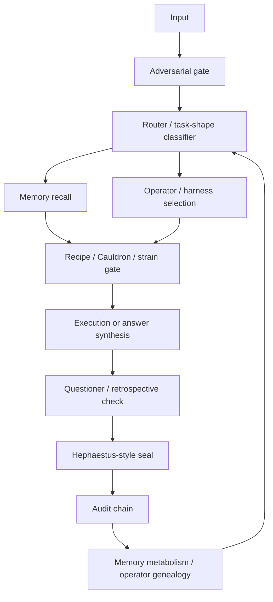

# Wren Module Map For Reviewers

This is a sanitized high-level map of the private Wren machine.

## Important Organs

- **Adversarial gate**: catches prompt injection, memory poisoning, tool-result poisoning, and soft bypass language.
- **Cauldron**: classifies output/moves as gold, useful, junk_dna, or review-needed.
- **Recipe engine**: stores reusable reasoning/operator shapes.
- **Memory layers**: short, long, foundational ledgers in the private system.
- **Operator genealogy**: tracks which operator families reproduce and continue winning.
- **ARC / black-box solver**: local exact-output benchmark harness.
- **Fingerprint engine**: cross-domain signature extraction and validation.
- **Dashboard / daemons**: freshness, learning pulse, memory metabolism, and telemetry.

## Review Boundary

The repo includes small local versions of these ideas. The private system is larger and contains personal/private state that should not be published.

